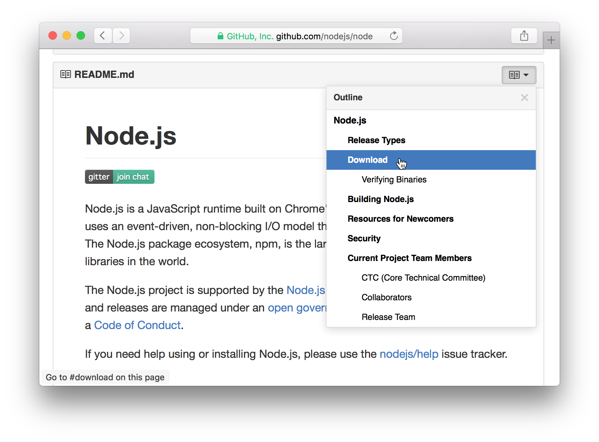

## Table of Contents for GitHub

Browser extension that adds a table of contents to repositories, gists and wikis.

Available for [Google Chrome][Chrome], [Firefox][Firefox], [Safari][Safari] and as [userscript][Userscript].

This is a simple browser extension that makes reading long files and pages on GitHub easier. If you regurlarly scroll around readmes and wikis looking for specific information, this is for you. Find what you are looking for, quickly.

Works almost anywhere on GitHub.

- Works with files in repos, gists, and wikis
- Supports any [GitHub markup](https://github.com/github/markup#markups)
- Supports editing and creating files and wiki pages directly on GitHub
- It's simple and unobtrusive

## Get It

🚀 **[Chrome (Chrome Web Store)][Chrome]**

🚀 **[Firefox (Mozilla Add-Ons)][Firefox]**

🚀 **[Safari][Safari]**

🚀 **[Userscript][Userscript]**

### A Note on Safari

The Safari extension is not (yet) hosted on Apple's Extension Gallery. To install, [download the extension `safari.safariextz` from the `dist` folder][Safari] and open it. Since the extension is not from the Gallery, Safari will ask you to trust it.

## Limitations

If there are multiple files on the same page, a table of contents will currently only be shown for the first file. This is a rare issue and only occurs in gists but not in repos or wikis. Support for multiple files [might be added in the future](https://github.com/arthurhammer/github-toc/issues/5).

## Build Yourself

You need [`node`](https://nodejs.org/)/[`npm`](https://www.npmjs.com/).

    git clone git@github.com:arthurhammer/github-toc.git # Or download zip file
    cd github-toc

    # Install development dependencies
    npm install

    # Build unpackaged extensions for testing and running locally
    npm run build

    # Build extensions packaged for distribution
    npm run dist

Packaged and unpackaged builds live in the [`dist`](dist/) folder. [`gulp`](http://gulpjs.com/) is used to run the tasks (installed with the other dependencies).

(The build system is a bit much for such a simple extension. I just wanted to try out `npm`, `gulp` and all the other things I hadn't used before.)

### Testing and Running Locally

First build the unpackaged extensions:

    npm run build

Install the extensions in the browser as described below. To try the extension out, test it on the [cases described in the `test` folder](test/Readme.md).

#### Google Chrome

- Open the extensions page in Chrome
- Choose `dist/chrome` under “Load unpacked extension...”

#### Firefox

    npm run firefox

This will open a new Firefox instance with the extension installed.

#### Safari

- Open Extension Builder in Safari
- Add `dist/safari.safariextension` as existing extension
- Click “Install”

Note: Unless you have a valid Safari Extension certificate, the extension will automatically be removed whenever you quit Safari. You will also not be able to build the packaged extension for direct install. [The certificate requires a (paid) Apple Developer Program membership](https://developer.apple.com/library/safari/documentation/Tools/Conceptual/SafariExtensionGuide/ExtensionsOverview/ExtensionsOverview.html#//apple_ref/doc/uid/TP40009977-CH15-SW26).

#### Userscript

Install `dist/github-toc.user.js` directly in the browser (if supported) or with your favorite userscript manager (e.g. [Greasemonkey](https://addons.mozilla.org/en-US/firefox/addon/greasemonkey/) or [Tampermonkey](https://tampermonkey.net)).

## Changelog

### 0.2.2

- Fixed several issues caused by updates to the GitHub website
- Various minor updates

### 0.2.1

- Added Firefox version
- Added userscript version

[Chrome]: https://chrome.google.com/webstore/detail/github-readme-table-of-co/hlkhpeomjgelmljaknhoboeohhgmmgcn
[Firefox]: https://addons.mozilla.org/en-US/firefox/addon/github-readme-toc/
[Userscript]: https://github.com/arthurhammer/github-toc/raw/master/dist/github-toc.user.js
[Safari]: https://github.com/arthurhammer/github-toc/blob/master/dist/safari.safariextz?raw=true
