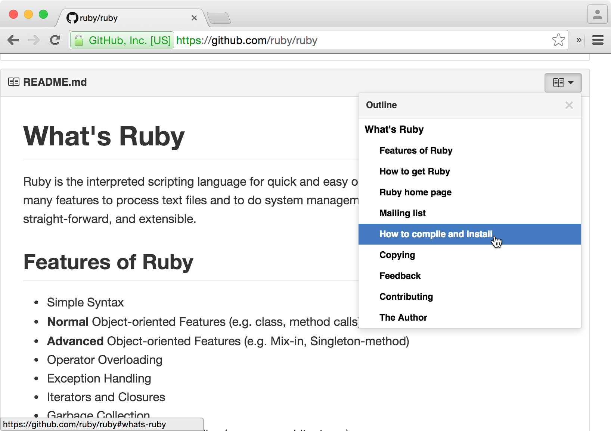

## Table of Contents for GitHub

Browser extension that adds a table of contents to readmes in GitHub repos, gists and wikis. Quickly find what you are looking for.

Available for [Google Chrome](https://chrome.google.com/webstore/detail/github-readme-table-of-co/hlkhpeomjgelmljaknhoboeohhgmmgcn), [Firefox](https://addons.mozilla.org/en-US/firefox/addon/github-readme-toc/), and as a [userscript](https://github.com/arthurhammer/github-readme-toc/raw/master/dist/github-toc.user.js).

## Get It

🚀 **[Chrome Web Store](https://chrome.google.com/webstore/detail/github-readme-table-of-co/hlkhpeomjgelmljaknhoboeohhgmmgcn)**

🚀 **[Mozilla Add-Ons](https://addons.mozilla.org/en-US/firefox/addon/github-readme-toc/)**

🚀 **[Userscript](https://github.com/arthurhammer/github-readme-toc/raw/master/dist/github-toc.user.js)**

A Safari extension is coming soon.

## Build Yourself

You need [`node`](https://nodejs.org/) and [`gulp`](http://gulpjs.com/).

    # Install development dependencies
    npm install

    # Build unpackaged extensions
    gulp build

    # Build packaged extensions for distribution
    gulp dist

(You don't have to run `gulp build` before `gulp dist` manually.)

The builds live in the `dist` folder.

To try the extension out, test it on some of the [files linked in the `test` folder](https://github.com/arthurhammer/github-readme-toc/blob/master/test/Readme.md).

## Changelog

### 0.2.2

- Fixed several issues caused by updates to the GitHub website
- Various minor updates

### 0.2.1

- Added Firefox version
- Added userscript version
